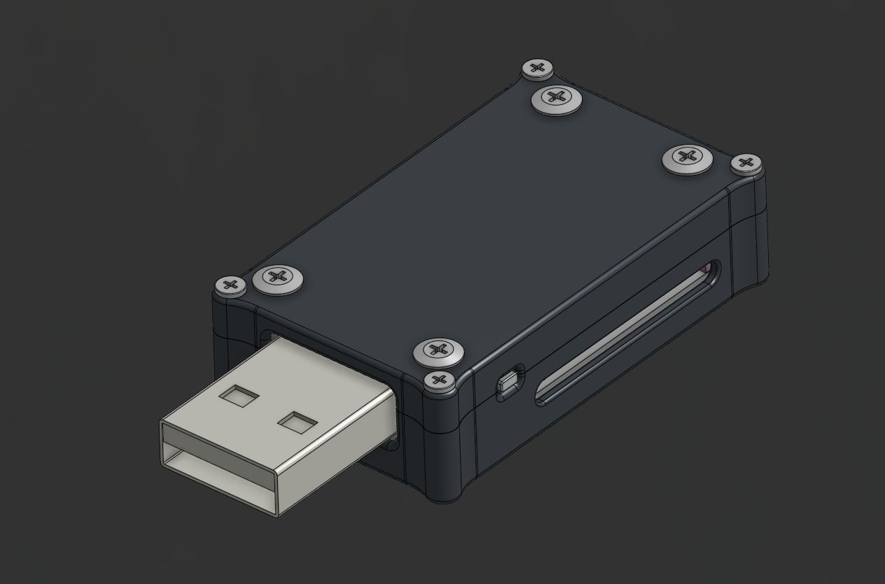
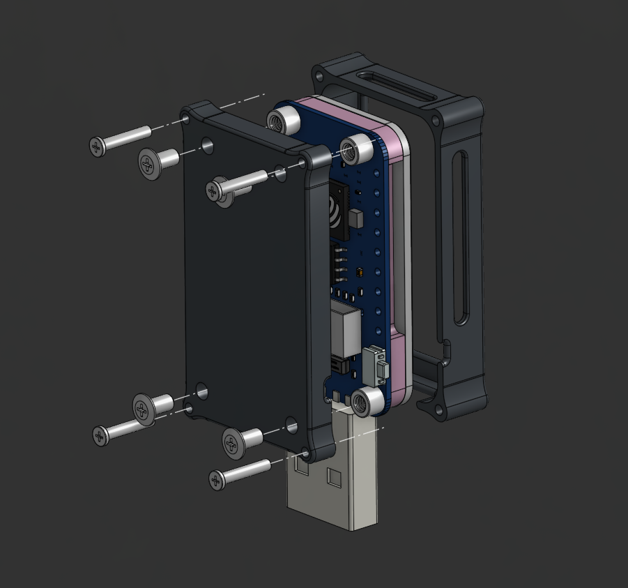
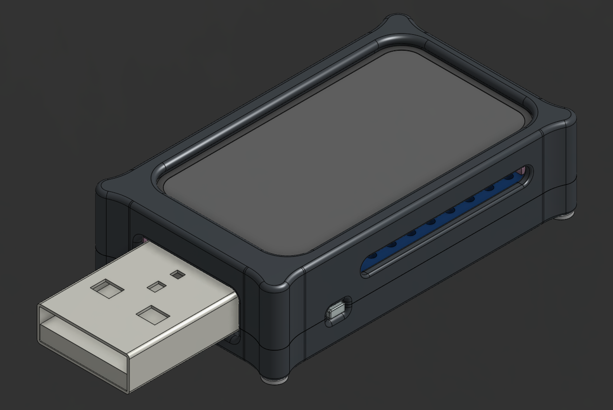

# Preview

| ESP-STICK Assembly Bottom View | ESP-STICK Exploded Assembly View | ESP-STICK Assembly Top View |
| --- | --- | --- |
|  |  |  |

## Mechanical Files

- `step/ESP-STICK-ASSEMBLY.step` is the current complete assembly.
- `step/ESP-STICK-ENCLOSURE-TOP.step` and
  `step/ESP-STICK-ENCLOSURE-BOTTOM.step` are the enclosure shell models.
- `stl/ESP-STICK-ENCLOSURE-TOP.stl` and
  `stl/ESP-STICK-ENCLOSURE-BOTTOM.stl` are the printable shell exports.
